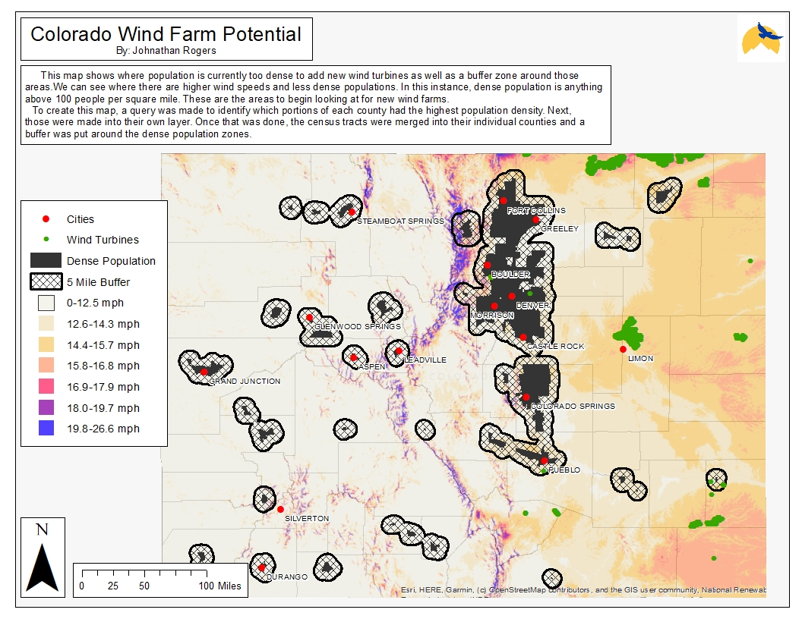

# Johnathan's GIS Portfolio
I am a student at Colorado Mountain College studying Outdoor Recreational Leadership. This is a collection of my GIS work. I enjoy trying to find connections between information and maps help make those connections.
## Colorado Wind Farm Potential
This map marks off populated counties in black surrounded by a 5 mile buffer zone. These populated areas designate where the most opposition for buildig new wind turbines is expected to be. All of this is laid over a layer which shows the average wind speeds in the state of Colorado. Knowing where more wind is found in Colorado acccompanied by the current locations of wind turbines, one can visualize what areas have potential for wind farm expansion. More information of those sites would need to be gathered to proceed with such an expansion project.

